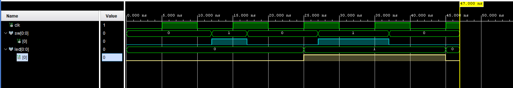

# LED Toggle Using D Flip-Flop (Basys 3)

## Overview
This project implements a simple LED toggle using a D flip-flop on the
Basys 3 FPGA board (Xilinx Artix-7).
It demonstrates basic synchronous design concepts using VHDL and serves
as an introductory FPGA project.

## Objectives
- Understand synchronous logic and clocked processes
- Implement a D flip-flop in VHDL
- Drive physical I/O using XDC constraints
- Build and program a design using Vivado

## Design Architecture
The design consists of a clocked D flip-flop driving a single LED output.
The LED state toggles on each falling edge of the switch.

## Behavior
Each time the falling edge of the switch is detected, the D flip-flop (and therefore the LED)
will toggle on the following clock cycle.

## Tools & Hardware
- FPGA Board: Digilent Basys 3 (Artix-7)
- Toolchain: Xilinx Vivado
- Language: VHDL
- Constraints: XDC

## Design Description
- The design uses the onboard 100 MHz clock.
- A D flip-flop toggles the LED state on each falling edge of the switch.
- Output is mapped to an onboard LED via XDC constraints.

## Verification
- Functional behavior verified through hardware testing.
- LED toggles as expected when programmed onto the Basys 3.
- Timing verified through Vivado implementation reports.

## Defense & Industry Relevance
This project demonstrates:
- Fundamental synchronous digital design
- Proper use of clocked logic
- Pin constraint management
