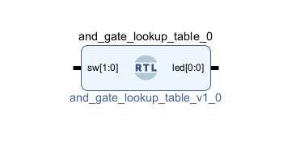
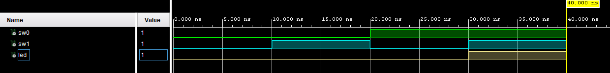

# LUT-Based AND Gate (Basys 3)

## Overview
This project implements a 2-input AND gate using a lookup table (LUT)
on the Basys 3 FPGA (Xilinx Artix-7).
Rather than relying on inferred logic, the design explicitly models
combinational behavior as it is implemented in FPGA fabric.

## Objectives
- Understand how LUTs implement combinational logic
- Map Boolean logic to truth tables
- Reinforce FPGA-specific implementation concepts
- Practice Vivado simulation and constraints usage

## Tools & Hardware
- FPGA Board: Digilent Basys 3 (Artix-7)
- Toolchain: Xilinx Vivado
- Language: VHDL
- Constraints: XDC

## Design Architecture
The AND function is implemented using a lookup table that maps
the two input signals to a single output based on their truth table.

Truth table:

| A | B | Y |
|---|---|---|
| 0 | 0 | 0 |
| 0 | 1 | 0 |
| 1 | 0 | 0 |
| 1 | 1 | 1 |

## Simulation & Verification
Functional verification was performed using Vivado simulation.
The waveform below shows the output transitioning high only when
both inputs are asserted.

## FPGA & Industry Relevance
This project demonstrates:
- How combinational logic maps to FPGA LUTs
- The relationship between Boolean logic and hardware implementation
- Foundational concepts used in datapaths, control logic, and DSP designs

Understanding LUT-based logic is critical for efficient FPGA design
in aerospace, defense, and embedded systems.
