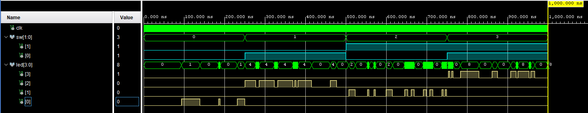

# 4-to-1 Demux LED Blinker with LFSR Timing (Basys 3)

## Overview
This project implements a 4-to-1 demultiplexer that selects
which of four LEDs is active while blinking at a rate determined
by a 24-bit linear feedback shift register (LFSR).
The design demonstrates pseudo-random timing behavior and
multi-output control on the Basys 3 FPGA.

## Objectives
- Implement a 24-bit LFSR for pseudo-random sequencing
- Use a 4-to-1 demultiplexer to control multiple outputs
- Generate non-uniform blink timing without a simple counter
- Integrate multiple modules into a cohesive system

## Tools & Hardware
- FPGA Board: Digilent Basys 3 (Xilinx Artix-7)
- Toolchain: Xilinx Vivado
- Language: VHDL
- Constraints: XDC

---

## Design Architecture
The system is composed of the following modules:

- `linear_feedback_shift_register`  
  Generates a pseudo-random sequence used to control blink timing

- `four_to_one_demux`  
  Routes the blink signal to one of four LEDs

- `demux_LSFR_LED_blinker_top`  
  Coordinates LFSR overflow detection and LED selection

Key behavior:
- The LFSR runs continuously
- When the LFSR overflows (or reaches a terminal condition),
  a blink event is generated
- The demultiplexer selects which LED receives the blink signal

---

## Simulation & Verification
Simulation was performed in Vivado to verify correct LFSR behavior
and LED selection.
The waveform below shows the LFSR state evolution, overflow detection,
and corresponding LED output activity.

---

## FPGA & Industry Relevance
This project demonstrates several FPGA-relevant concepts:

- Pseudo-random sequence generation using LFSRs
- Timing control without fixed counters
- Multi-output routing using demultiplexers
- Modular, hierarchical RTL design

LFSRs are widely used in FPGA systems for timing variation,
test pattern generation, and control logic in aerospace,
defense, and communications systems.
