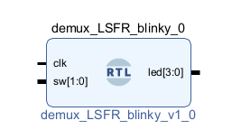
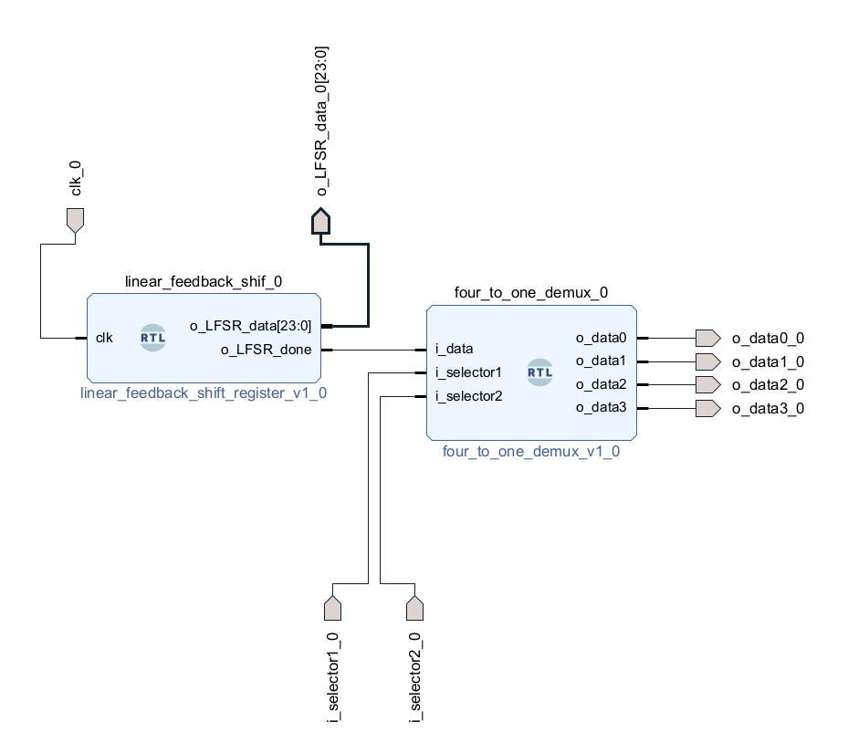

# 4-to-1 Demux LED Blinker with LFSR Timing (Basys 3)

## Overview
This project implements a 4-to-1 demultiplexer that selects
which of four LEDs is active while blinking at a rate determined
by a 24-bit linear feedback shift register (LFSR).
The design demonstrates pseudo-random timing behavior and
multi-output control on the Basys 3 FPGA.

## Objectives
- Implement a 24-bit LFSR for pseudo-random sequencing
- Use a 4-to-1 demultiplexer to control multiple outputs
- Generate non-uniform blink timing without a simple counter (less resources needed, but also less precise timing)
- Integrate multiple modules into a cohesive system

## Tools & Hardware
- FPGA Board: Digilent Basys 3 (Xilinx Artix-7)
- Toolchain: Xilinx Vivado
- Language: VHDL
- Constraints: XDC

---

## Design Architecture
The system is composed of the following modules:

- `linear_feedback_shift_register`  
  Generates a pseudo-random sequence used to control blink timing.

  Has pin o_LSFR_data for reading data from all registers at once. Not used in this design.

- `four_to_one_demux`  
  Routes the blink signal to one of four LEDs

- `demux_LSFR_LED_blinker`  
  Coordinates LFSR overflow detection and LED selection

## Top module

## Internal Submodules

Key behavior:
- The LFSR runs continuously
- When the LFSR is full of zeroes send a "done" pulse
- The demultiplexer selects which LED turns on when the "done" pulse is received

---

## Simulation & Verification
Simulation was performed in Vivado to verify correct LFSR behavior
and LED selection.

The LFSR is intentionally implemented as a fixed 24-bit register to model a specific timing behavior. Simulation focuses on functional correctness rather than parameterized scaling.

To improve simulation observability, the LFSR generates a single-cycle pulse on the falling edge of the MSB rather than full register rollover. The limited simulation time Vivado allows was too short to see the module working on human scales of time.

Therefore, science was conducted.
Said science resulted in two changes for the purpose of capturing a simulated waveform: increasing simulated clock speed, and the detection of the falling edge of the MSB for pulse generation instead of the full register rollover present for human speed interaction.

The waveform below shows the MSB falling edge detection and corresponding LED output activity.

---

## FPGA & Industry Relevance
This project helped me learn:

- Pseudo-random sequence generation using LFSRs
- Timing control without fixed counters
- Multi-output routing using demultiplexers
- Modular, hierarchical RTL design
- It may be necessary to tweak a simulation away from reality to work within the constraints of the design software
  
LFSRs can be used in FPGA systems for timing variation, test pattern generation, and control logic.
