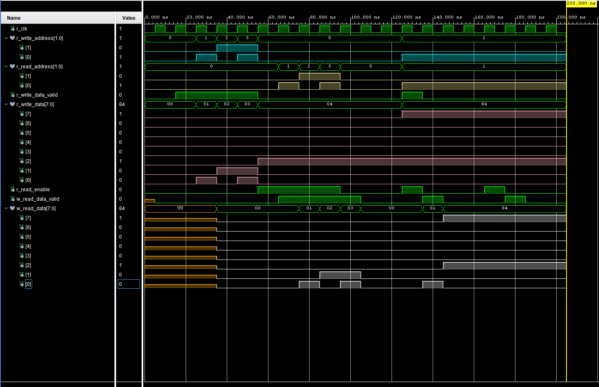

# Dual-Port RAM Implementation (Basys 3)

## Overview
This project implements a **dual-port RAM** in VHDL, allowing two independent ports to access a shared memory resource concurrently.  
The design demonstrates basic memory architecture, concurrent read/write access, and verification through simulation.

The project focuses on correctness, clarity, and FPGA-friendly coding practices rather than maximum performance or parameterization.

---

## Objectives
- Implement a dual-port RAM using synthesizable VHDL
- Support independent memory access on two ports
- Demonstrate safe concurrent read/write behavior
- Verify correct operation using a dedicated testbench

---

## Tools & Hardware
- **FPGA Board:** Digilent Basys 3 (Xilinx Artix-7)
- **Toolchain:** Xilinx Vivado
- **Language:** VHDL
- **Constraints:** XDC

---

## Design Architecture
The system is composed of the following primary components:

- `dual_port_ram`  
  Implements a shared memory array with two independent access ports.  
  Each port has its own address, data input, write enable, and data output.

---

## Top-Level Module

Key features:
- Shared memory array
- Two independent ports
- Synchronous operation
- Deterministic read/write timing

---

## Simulation & Verification
Simulation was performed in Vivado to validate correct dual-port operation under a variety of access scenarios.

The testbench verifies:
- Independent writes on each port
- Correct data reads from previously written addresses
- Expected behavior when both ports access memory concurrently (in this case, undefined behavior)

The focus of simulation is **functional correctness**, not long-duration timing or throughput analysis.

The waveforms below show a small simulation of the dual-port RAM being filled with incremental values, being read, then an attempted simultaneous read/write
at the end. For more detail, please see the comments in the testbench in /sim/testbench_dual_port_RAM.vhd

---

## FPGA & Industry Relevance
This project demonstrates several foundational FPGA design concepts:

- Memory architecture using on-chip RAM
- Concurrent access to shared resources
- Synchronous design practices
- RTL written for block RAM inference
- Clear separation of RTL and verification logic

Dual-port RAMs are commonly used in FPGA systems for FIFOs, buffering, producer/consumer designs, and data sharing between independent logic blocks.
