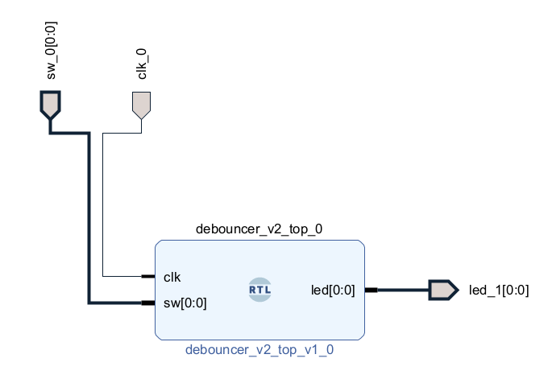
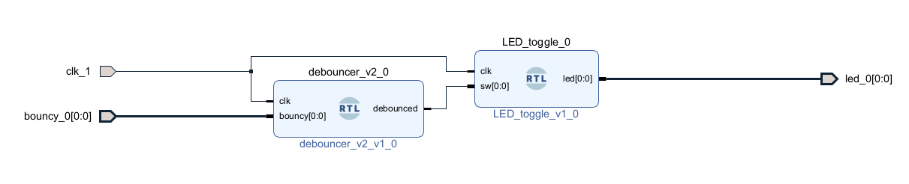
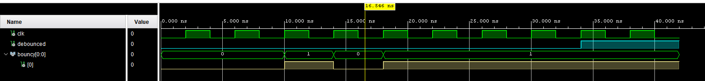

# Switch Debouncer with LED Toggle (Basys 3)

## Overview
This project implements a switch debouncer on the Basys 3 FPGA
and integrates it with a previously developed LED toggle module.
The design demonstrates how real-world inputs are conditioned
before being used by synchronous logic.

A top-level module combines the debouncer and LED toggle
from a previous beginner project to form a complete, reusable system.

## Objectives
- Understand mechanical switch bounce and its effects
- Implement a debounce filter in hardware
- Reuse an existing module in a new design
- Practice top-level module integration in VHDL

## Tools & Hardware
- FPGA Board: Digilent Basys 3 (Artix-7)
- Toolchain: Xilinx Vivado
- Language: VHDL
- Constraints: XDC

---

## Design Architecture
The design consists of three primary modules:

- `debouncer_v2`  
  Filters noisy mechanical switch input and produces a clean signal

- `LED_toggle`  
  Toggles an LED on each detected falling edge of the switch (reused module)

- `debouncer_v2_top`  
  Connects the debounced switch signal to the LED toggle module

At the top level, the block diagram looks like the following:

And inside the top-level:

Key points:
- Switch input is asynchronous and noisy
- Debouncer synchronizes and stabilizes the signal
- LED toggle operates on clean, debounced transitions

---

## Simulation & Verification
Simulation was performed using Vivado to verify debounce behavior.
The waveform below shows the raw switch input bouncing,
while the debounced output transitions cleanly.

---

## FPGA & Industry Relevance
This project demonstrates several real-world FPGA concepts:

- Conditioning asynchronous external inputs
- Mitigating signal noise in hardware
- Hierarchical design and module reuse
- Clean separation between signal processing and control logic

These concepts are fundamental in embedded, aerospace,
and defense FPGA systems where external inputs are common.
